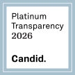

---
social:
  cards_layout: default/only/image
  cards_layout_options:
    background_image: theme/public/globe-cover.svg
---

# { width=70% .center }

Founded in 2024, Triplebit Corporation ("Triplebit") is a 501(c)(3) public charity and transit internet service provider (ISP) based in Delaware.

Our mission is to protect and uphold the rights to privacy, access to information, anonymity, and free speech. To further our mission, Triplebit operates unfiltered, high capacity privacy and internet infrastructure with direct peering to the [Midwest Internet Cooperative Exchange](https://micemn.net/), Kansas City Internet Exchange, Saint Louis Internet Exchange, and Houston Internet Exchange.

We enhance network privacy by:

- Operating infrastructure on hardware we own
- Peering directly with major content providers and content delivery networks, reducing middlemen ISPs
- Homing our services on major Internet Exchanges

Triplebit envisions a world where access and privacy are the defaults. We encourage you to read more about privacy at [privacyguides.org](https://www.privacyguides.org).

## Status

- Follow <a href="https://mstdn.plus/@triplebit" rel="me">@triplebit@mstdn.plus</a> on Mastodon
- View Triplebit's Tor relays on Tor Project's [Relay Search](https://metrics.torproject.org/rs.html#search/as:AS401332)

## Network

Triplebit's [Autonomous System Number (ASN)](https://www.arin.net/resources/guide/asn/) is [401332](https://whois.arin.net/rest/asn/AS401332.html).

- View Triplebit's live [BGP/peering status](https://bgp.tools/as/401332) on bgp.tools

To troubleshoot connectivity to/from our network, you can perform a traceroute or ping from our network to any internet host via [this web portal](https://bgp.he.net/AS401332#_traceroute): Simply enter the IP/hostname you want to query, select `Probe #7395` from the list, and our [RIPE anchor](https://atlas.ripe.net/probes/7395) will query the host and return the results to you.

## Friends

[![Privacy Guides]](https://www.privacyguides.org/en/){ rel=nofollow target=_blank title="Privacy Guides" }
[![Ivy Cyber]](https://ivycyber.com){ rel=nofollow target=_blank title="Ivy Cyber" }
[![Power Up Privacy]](https://powerupprivacy.com){ rel=nofollow target=_blank title="Power Up Privacy" }
[![Unredacted]](https://unredacted.org){ rel=nofollow target=_blank title="Unredacted" }
[![Kiwix]](https://kiwix.org){ rel=nofollow target=_blank title="Kiwix" }
[![Tor Project]](https://www.torproject.org){ rel=nofollow target=_blank title="Tor Project" }
[![Emerald Onion]](https://emeraldonion.org){ rel=nofollow target=_blank title="Emerald Onion" }
[![Monero]](https://getmonero.org){ rel=nofollow target=_blank title="Monero" }
[![Hurricane Electric]](https://he.net){ rel=nofollow target=_blank title="Hurricane Electric" }

  [Privacy Guides]: /public/friends/privacy-guides.webp
  [Ivy Cyber]: /public/friends/ivy-cyber.webp
  [Power Up Privacy]: /public/friends/power-up-privacy.webp
  [Unredacted]: /public/friends/unredacted.webp
  [Kiwix]: /public/friends/kiwix.webp
  [Tor Project]: /public/friends/tor-project.webp
  [Emerald Onion]: /public/friends/emerald-onion.webp
  [Monero]: /public/friends/monero.webp
  [Hurricane Electric]: /public/friends/hurricane-electric.webp

## Documents

- [IRS Determination Letter](/public/documents/irs-determination.pdf)
- [IRS Form 1023-EZ](/public/documents/irs-1023-ez.pdf)
- [Delaware Certificate of Incorporation](/public/documents/certificate-of-incorporation.pdf)
  
Yearly Documents:

- 2026: [IRS Form 5768](/public/documents/irs-2026-form-5768.pdf)
- 2025: [Form 990-N](/public/documents/irs-2025-form-990n.pdf)

[{ width=128 height=128 }](https://app.candid.org/profile/16663599/triplebit-corporation/?pkId=aee92b4a-e0bc-427c-b5aa-e3750023eb8f&isActive=true)
